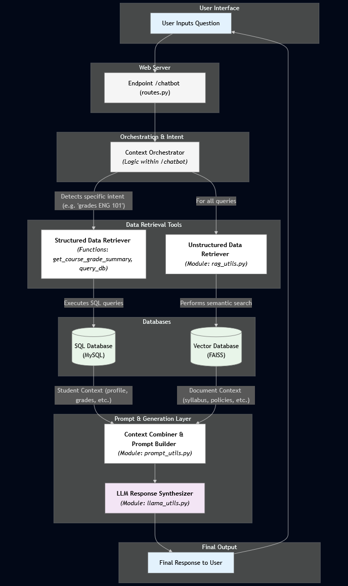
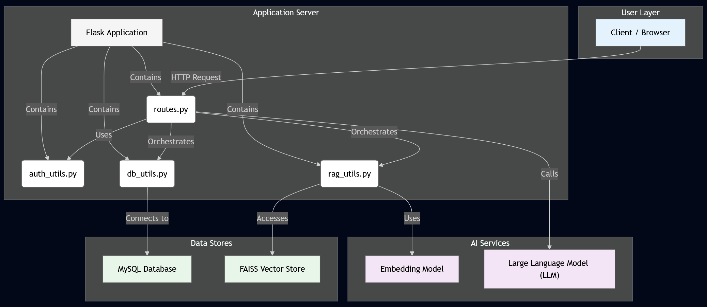
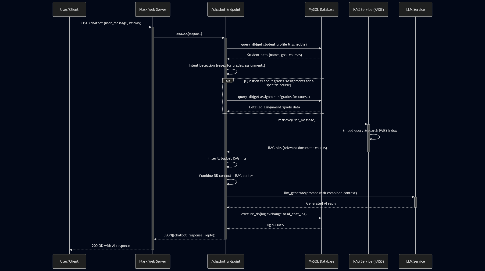
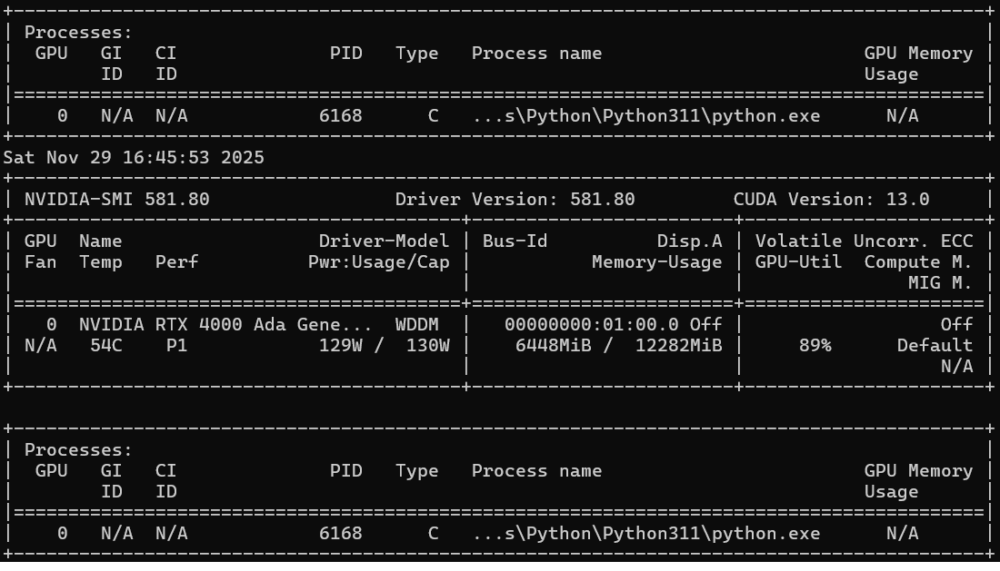
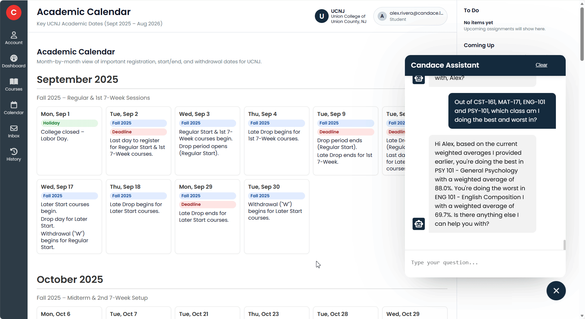

# **Candace: AI Assistant for Higher Education**

*A GPU-accelerated, RAG-powered LLM assistant built for Union College of Union County, NJ (UCNJ)*

Candance is a locally hosted retrieval augmented system with Canvas-style academic support. This is a prototype intended to mimic what an AI assistant would look like in Canvas.

- Retieval Augmented Generation (RAG)
- GPU-accelerated LLaMA inference (llama_cpp + CUDA)
- MySQL-backend student data
- Semantic search using SentenceTransformers embeddings
- Canvas-style academic dashboards

Candace was actively developed as part of the **2025-2026 Undergraduate Research Program** at UCNJ.

---

## **Project Overview**

Candace servers as an AI layer on top of college-wide student information:
- assignments
- grades
- schedules
- academic calendars
- syllabi
- course policies

Through natural language queries, Candace can summarize scattered LMS information and return structured, contextual answers in **under a few seconds (with GPU)**.

The system reduces **cognitive load** by collapsing multi-page Canvas navigation into a single conversational interface.

---

## **Research Team**

- **Professor Emilio Vasquez** — Research Mentor, Project Manager, Code and logic revisor
- **Miguel Torres** — Team Lead, Back-End Developer & Designer  
- **Angello Bravo** — AI Developer & Front-End Developer  
- **Julio Padilla** — Database Engineer & Primary Researcher  

---

## **Tech Stack**

| Layer | Technologies |
|------|---------------|
| **Backend** | Flask (Python), MySQL, SQLAlchemy-style queries |
| **AI/ML** | llama_cpp, CUDA, SentenceTransformers, FAISS |
| **RAG** | PDF/Text ingestion, semantic search, chunking, student-specific docs |
| **Front-End** | HTML / CSS / JS *(technologies to be finalized)* |
| **Vector Store** | FAISS GPU/CPU
| **Model** | Meta LLaMA 3.1 8B Instruct (Q4_K_M GGUF) | |
| **Deployment** | Windows (CUDA 13.0) |
| **Version Control** | Git & GitHub |

---

## **Current Features**

**AI-Powered LMS Assistant**

Candace can answer:
- “What assignments do I have due this week from all my courses?”
- “What are my grades for my current courses”
- “Summarize all deadlines this month.”
- “What are the minimum points I need per upcoming assignment to pass with at least a 70% from all my courses?”
- “Show my academic calendar for Spring 2026.”

**GPU-Accelerated LLM Inference**

Up to **14.4x** faster than CPU-only execution.

**RAG (Retrieval-Augmented Generation)**

Candace uses:
- student-specific MySQL exports
- global catalog exports
- syllabi, calendars, instructor info
- semantic search for relevant chunks

**Accurate, Hallucination-Safe Answers**

System prompt + RAG grounding prevents fake data responses.

**Real Student Data Integration**

Full ingestion of:
- assignments
- grades
- schedules
- course sections
- term calendars
- professor info

**Canvas-like UI**

Supports:
- weekly view
- academic calendar grid
- assignment timelines
- profile page with photo fallback

---

## **Project Structure**

```
Candace Virtual Assistant
├── .vscode/
│   └── settings.json
├── app/
│   ├── data/
│   │   └── student_database_final.json
│   ├── models/
│   │   ├── Meta-Llama-3.1-8B-Instruct-Q4_K_M.gguf
│   │   └── README.md
│   ├── services/
│   │   ├── assistant/
│   │   │   ├── __init__.py
│   │   │   ├── llama_utils.py
│   │   │   └── prompt_utils.py
│   │   ├── __init__.py
│   │   └── rag_utils.py
│   ├── static/
│   │   ├── css/
│   │   │   ├── chatbot.css
│   │   │   └── style.css
│   │   ├── images/
│   │   │   ├── architecture.png
│   │   │   ├── nodes_rag.png
│   │   │   ├── nvdidia-smi.png
│   │   │   ├── sequence_diagram.png
│   │   │   └── ucnj-logo.png
│   │   └── js/
│   │       └── chatbot.js
│   ├── templates/
│   │   ├── admin/
│   │   │   ├── admin_dashboard.html
│   │   │   ├── chat_logs.html
│   │   │   ├── classes.html
│   │   │   ├── courses.html
│   │   │   ├── rag_tools.html
│   │   │   ├── students.html
│   │   │   └── users.html
│   │   ├── student/
│   │   │   ├── account.html
│   │   │   ├── calendar.html
│   │   │   ├── course_analytics.html
│   │   │   ├── course_announcements.html
│   │   │   ├── course_assignments.html
│   │   │   ├── course_cengage.html
│   │   │   ├── course_files.html
│   │   │   ├── course_grades.html
│   │   │   ├── course_modules.html
│   │   │   ├── course_pages.html
│   │   │   ├── course_people.html
│   │   │   ├── course_quizzes.html
│   │   │   ├── course_shell.html
│   │   │   ├── course_syllabus.html
│   │   │   ├── courses.html
│   │   │   ├── history.html
│   │   │   └── inbox.html
│   │   ├── _course_nav.html
│   │   ├── base.html
│   │   ├── dashboard.html
│   │   ├── login-page.html
│   │   └── sign-up-page.html
│   ├── vectorstore/
│   │   └── store/
│   │       ├── candace.faiss
│   │       └── meta.json
│   ├── __init__.py
│   ├── auth_utils.py
│   ├── crud.py
│   ├── db_utils.py
│   ├── main.py
│   └── routes.py
├── database/
│   ├── seeds/
│   │   ├── module_data/
│   │   │   ├── cst-161-fake-module-data.sql
│   │   │   ├── cst-162-fake-module-data.sql
│   │   │   ├── eng-101-fake-module-data.sql
│   │   │   ├── eng-102-fake-module-data.sql
│   │   │   ├── mat-171-fake-module-data.sql
│   │   │   ├── mat-172-fake-module-data.sql
│   │   │   ├── phy-111-fake-module-data.sql
│   │   │   ├── phyl-111-fake-module-data.sql
│   │   │   └── psy-101-fake-module-data.sql
│   │   ├── course-syllabus-fake-data.sql
│   │   ├── lecturers-fake-data.sql
│   │   └── student-fake-data.sql
│   ├── candace.db
│   ├── schema.sql
│   ├── second_run.sql
│   └── testDatabase.py
├── docs/
│   ├── catalog/
│   │   ├── catalog_all_courses.txt
│   │   ├── current_term_courses.txt
│   │   └── future_term_courses.txt
│   ├── db_global/
│   │   ├── courses_global.txt
│   │   └── syllabi_global.txt
│   ├── db_students/
│   │   ├── student_1000001.txt
│   │   ├── student_1000002.txt
│   │   ├── student_1000003.txt
│   │   ├── student_1000004.txt
│   │   ├── student_1000005.txt
│   │   ├── student_1000006.txt
│   │   ├── student_1000007.txt
│   │   ├── student_1000008.txt
│   │   ├── student_1000009.txt
│   │   ├── student_1000010.txt
│   │   ├── student_1000011.txt
│   │   ├── student_1000012.txt
│   │   ├── student_1000013.txt
│   │   ├── student_1000014.txt
│   │   ├── student_1000015.txt
│   │   └── student_1000016.txt
│   ├── weekly/
│   │   ├── 2025FA-BIOL-105-_weeks.txt
│   │   ├── 2025FA-CST-100-_weeks.txt
│   │   ├── 2025FA-CST-101-_weeks.txt
│   │   ├── (…many more weekly course files…)
│   │   ├── 2026SP-HIS-102-_weeks.txt
│   │   ├── 2026SP-SOC-207-_weeks.txt
│   │   └── 2026WI-SOC-101-_weeks.txt
│   └── academic_calendars_2025_2026.txt
├── llama-cpp-python/ # Full Llama.cpp Python binding (vendor repo)
│   ├── .git/
│   ├── .github/
│   ├── docker/
│   ├── docs/
│   ├── examples/
│   ├── llama_cpp/
│   ├── scripts/
│   ├── tests/
│   ├── vendor/
│   ├── CMakeLists.txt
│   ├── pyproject.toml
│   └── README.md
├── tests/
│   ├── demo_account.py
│   └── inference_test.py
├── venv-gpu/ # (virtual environment - contents omitted)
├── .env
├── .gitignore
├── APIs.env
├── config.py
├── export_db_rag_docs.py
├── gpu-test.py
├── ingest_rag.py
├── migrate_json_to_mysql.py
├── requirements.txt
├── requirements-gpu.txt
├── requirements-test-gpu.txt
├── run.py
├── run_gpu.sh
├── seed_db.py
└── test_llama_gpu.py
```

---

## **System Architecture**

Candance is built using a modular, service-oriented design that integrates:

- **Flask** as the application server
- **MySQL** as the structured data store
- **FAISS** as the semantic vector store
- **SentenceTransformers** for embeddings
- **llama_cpp** for GPU-accelerated LLaMA inference
- **A custom RAG pipeline**

The architecture ensures low latency, modularity, and maintainability while enabling precise, data-grounded responses.

## **High-Level Architecture Overview**

Below is the complete top-level system architecture showing how each module interacs:

**Application Server + Data Layers**

```
[ Client / Browser ]
         │
         ▼
┌─────────────────────────────┐
│        Flask Server         │
│  (routes.py orchestrates)   │
└─────────────────────────────┘
         │
         │
 ┌───────────────┐       ┌───────────────────┐
 │ auth_utils.py │       │   db_utils.py     │
 └───────────────┘       └───────────────────┘
         │                       │
         │                       │
         ▼                       ▼
┌─────────────────────┐   ┌──────────────────────┐
│   MySQL Database    │   │   FAISS Vector Store │
│ (students, grades,  │   │ (semantic embeddings)│
│ assignments, etc.)  │   └──────────────────────┘
└─────────────────────┘                 │
                                        │
                              ┌────────────────────┐
                              │   rag_utils.py     │
                              │ (RAG Retrieval)    │
                              └────────────────────┘
                                        │
                                        ▼
                             ┌───────────────────────┐
                             │ SentenceTransformer    │
                             │ (Embedding Model)      │
                             └───────────────────────┘
                                        │
                                        ▼
                             ┌────────────────────────┐
                             │ llama.cpp LLaMA Model  │
                             │ (GPU / CPU inference)  │
                             └────────────────────────┘
                                        │
                                        ▼
                            [ Final AI Response ]
```

**Detailed Component Diagram**



**RAG Pipeline Diagram**

This diagram explains:
- How SQL data (structured) combines with PDF/text syllabus & catalog data (unstructured) to produce combined context for the LLM.



**Request Sequence (Chatbot Flow)**



**GPU Runtime Verification**



**This proves:**
- CUDA 13.0
- RTX 4000 Ada GPU
- llama_cpp is actually offloading all layers
- GPU utilization approximately 90%
- Memory usage approximately 6.4 GB.

---

## **UI Demonstration**

This UI demonstration goes through:

- (1) User Interface, Academic monthly calendar UI.


- (2) the chatbot answering questions, and demonstrating the runtime for each query.


- (3) Admin interface


---

## **GPU Acceleration (Windows + NVIDIA CUDA)

**llama_cpp + PyTorch + SentenceTransformers + CUDA 13.0**

Candace fully supports GPU-accelerated inference using:
- NVIDIA RTX Ada GPUs
- llama_cpp CUDA kernels
- PyTorch (CUDA build)
- CUDA embedding generation

Below is the **exact working setup** used to conver the project from CPU-only to GPU-accelerated.

### **1. Install CUDA Toolkit (Windows 11)**
Download:
[CUDA Toolkit](https://developer.nvidia.com/cuda-downloads?target_os=Windows&target_arch=x86_64&target_version=11&target_type=exe_local)

Choose:
- OS: Windows
- Arch: x86_64
- Version: Windows 11
- Installer: exe (local)

Enable:
- CUDA Toolkit
- nvcc
- CUDA libraries

### **2. Install MSVC Build Tools (Required for llama_cpp CUDA)**

Download:
[MSVC Build Tools](https://visualstudio.microsoft.com/visual-cpp-build-tools/)

Enable:
- Desktop Development with C++
- MSVC v143
- Windows 10/11 SDK
- CMAKE, Ninja

### **3. Create a Dedicated GPU Virtual Environment**

```bash
python -m venv venv-gpu
source venv-gpu/Scripts/activate
pip install --upgrade pip
```

### **4. Install Requirements (Except PyTorch, and llama_cpp_python)**

The `requirements-gpu.txt` should have these already commented out.

Run this command: `pip install -r requirements-gpu.txt` to install everything.

### **5. Installing PyTorch (CUDA build)**

```bash
pip install torch torchvision torchaudio
  --index-url https://download.pytorch.org/whl/cu128
```

Then **verify:**

```bash
python
import torch
print(torch.cuda.is_available())
print(torch.cuda.get_device_name(0))
# CUDA should be availble, if it says it's not, installation went wrong
```

### **6. Build llama-cpp-python with CUDA**

```bash
pip uninstall -y llama-cpp-python

set FORCE_CMAKE=1
set GGML_CUDA=1
set CMAKE_ARGS=-DGGML_CUDA=on
set CMAKE_CUDA_ARCHITECTURES=89

pip install llama-cpp-python --no-cache-dir --force-reinstall
```

### **7. Validate GPU is Active**

```bash
python - <<EOF
from llama_cpp import llama_print_system_info
print(llama_print_system_info().decode())
EOF

# expect: found 1 CUDA devices:
#  Device 0: NVIDIA RTX 4000 Ada Laptop GPU
```

### **8. Run the App in GPU Mode**

Create a script at the root to make sure your app runs with GPU:

```bash
# You can call this script: `run_gpu.sh`, I created one already for you
@echo off
set LLAMA_GGUF_PATH=app\models\Meta-Llama-3.1-8B-Instruct-Q4_K_M.gguf
set LLAMA_N_CTX=8192
set LLAMA_N_GPU_LAYERS=-1
set CANDACE_EMBED_DEVICE=cuda

.\venv-gpu\Scripts\activate
python run.py
```

**Performance Summary:**
```
| Query Type           | CPU Time   | GPU Time |
| -------------------- | ---------- | -------- |
| Profile Lookup       | ~70 sec    | 3–5 sec  |
| Assignment List      | 59–106 sec | 3–8 sec  |
| Grade Queries        | 58–70 sec  | 3–7 sec  |
| Multi-Course Summary | 80–110 sec | 5–10 sec |
```

### **9. Running locally**

CPU mode:

```bash
python run.py
```

GPU mode:

```bash
./run_gpu.sh
```

## 🧠 Research Focus

This project is conducted under the **Union College Undergraduate Research Initiative** to explore how AI can enhance academic performance and time management for college students.  
Our research emphasizes:
- Integrating large language models into lightweight, deployable web apps.  
- Evaluating the usability of conversational AI for educational support.  
- Building maintainable, modular back-end systems for LLM deployment.

## **Setup Instructions**

These steps are assumed:
- Python 3.11+
- MySQL running locally (or accesible remotely)
- (Optional if intention is CPU-only) NVIDIA GPU + CUDA for GPU acceleration (this is Required if intended to use GPU)

1. Clone the repository  
   ```bash
   git clone https://github.com/Emilio-Vasquez/Candace-AI-Assistant.git
   cd Candace-Virtual-Assistant
   ```

2. Create a virtual environment (CPU or GPU)
- CPU-only (simple):
   ```
   python -m venv venv-cpu
   .\venv-cpu\Scripts\activate   # On Windows
   # source venv-cpu/bin/activate   # On macOS / Linux
   pip install --upgrade pip
   pip install -r requirements.txt
   # You will need to comment out torch and llama installation
   pip install flask torch transformers peft safetensors sentencepiece sentence-transformers faiss-cpu pypdf numpy llama-cpp-python tqdm
   python -m pip install --upgrade pip setuptools wheel
   python -m pip install --extra-index-url https://abetlen.github.io/llama-cpp-python/whl/cpu llama-cpp-python==0.3.2 --only-binary=:all:
   ```

- GPU section is above in the **GPU acceleration** section.

3. Configure environment variables

Create a `.env` file in the project root (same folder as `config.py`) and set:

```env
FLASK_ENV=development

DB_HOST=localhost
DB_PORT=3306
DB_USER=root
DB_PASSWORD=your_password_here
DB_NAME=candace_assistant

# LLaMA / RAG configuration
LLAMA_GGUF_PATH=app/models/Meta-Llama-3.1-8B-Instruct-Q4_K_M.gguf
LLAMA_N_CTX=8192
LLAMA_MAX_NEW_TOKENS=400
CANDACE_EMBED_DEVICE=cpu # set to "cuda" if using GPU
```

Adjust the `DB_USER`, `DB_PASSWORD`, and `LLAMA_GUFF_PATH` to match your local setup.

4. Create the MySQL database + schema  

You can either copy what's in `schema.sql` and paste it on your workbench in MySQL. Alternatively, you can run `python seed_db.py` on your terminal to create everything and seed everything except the `assignments_graded.sql`.

If you want fake grades run the contents of `assignments_graded.sql` into your MySQL workbench.

5. **Export DB to RAG documents**

Candace uses exported text files for RAG. Run:

```bash
python export_db_rag_docs.py
```

6. **Build the FAISS vector index (RAG ingest)**

Use the RAG ingest script (adjust the command if your script name/path differs):

```bash
python ingest_rag.py
```

This step:
- Reads from `docs/`
- Chunks and embeds text with SentenceTransformers
- Builds a FAISS index under `vectorstore/`

7. **Run the application**

CPU-only:
- Assuming already in venv, run: `python run.py`

GPU:
- Assuming already in venv-gpu, run: `./run_gpu.sh` or the file you created to run the GPU yourself.

The server will start at:

```text
http://127.0.0.1:5000/
```

You can log in with one of the **demo accounts** configured in the seed data. This should be username: `alex.rivera@candace.local` and password `student123`. There is also an admin in there with username: `admin@candace.local`. 

---

## **License**

This project is licensed under the [MIT License](https://opensource.org/licenses/MIT).  
You are free to use, modify, and distribute this software, provided that the original license and copyright notice are included.
